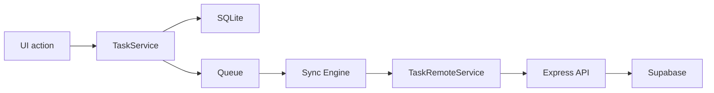
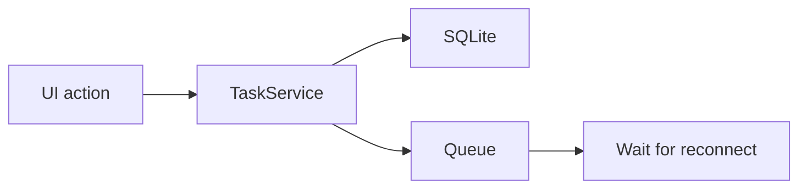

# API.md

## Cross-Platform Task System API

This document describes the backend API used by the mobile application.

The API is intentionally small and focused. It supports:

- authenticated profile access
- task CRUD
- task restore
- batch sync for offline replay

The backend does **not** implement its own login or signup routes. Authentication is handled by Supabase Auth on the client side, and the backend verifies the JWT on each protected request.

---

# Base URL

The base URL depends on your local environment.

Example:

```text
http://localhost:3000/api
````

If the app is running on a physical device, the backend URL should use your machine's local IP address instead of `localhost`.

---

# Authentication

All protected routes require a valid Supabase access token.

## Request Header

```http
Authorization: Bearer <access_token>
```

## How authentication works

1. The mobile app authenticates with Supabase Auth.
2. Supabase returns a JWT access token.
3. The app sends this token in the `Authorization` header.
4. The backend verifies the token.
5. The backend attaches the authenticated user to `req.user`.

### Important

The client does **not** send `user_id` for protected data access.

The backend always derives the user from the verified JWT.

---

# Common Response Format

Most endpoints return a normalized JSON response.

## Success

```json
{
  "success": true,
  "message": "Operation completed successfully.",
  "data": {}
}
```

## Error

```json
{
  "success": false,
  "message": "Something went wrong."
}
```

---

# Error Handling

The backend uses centralized error handling.

## Common HTTP status codes

* `200` — success
* `201` — created successfully
* `400` — bad request / validation error
* `401` — missing or invalid token
* `403` — forbidden
* `404` — resource not found
* `500` — unexpected server error

---

# Health Check

## GET `/health`

Returns a simple response confirming the server is running.

### Response

```text
The Task Management API is working
```

---

# Profile API

The profile API is used for onboarding and profile management.

---

## GET `/api/profile/me`

Fetch the currently authenticated user's profile.

### Authentication

Required.

### Request

```http
GET /api/profile/me
Authorization: Bearer <access_token>
```

### Response

```json
{
  "success": true,
  "message": "Profile fetched successfully.",
  "data": {
    "id": "uuid",
    "username": "aman",
    "full_name": "Aman Malik",
    "avatar_path": null,
    "bio": null,
    "timezone": null,
    "locale": "en",
    "theme": "system",
    "onboarding_completed": false,
    "is_active": true,
    "last_seen_at": null,
    "created_at": "2026-06-28T00:00:00.000Z",
    "updated_at": "2026-06-28T00:00:00.000Z"
  }
}
```

### Notes

* The backend derives the profile owner from `req.user.id`.
* The client never sends a `user_id`.
* If the profile does not exist, it should be created through the database trigger.

---

## PATCH `/api/profile/me`

Update the authenticated user's profile.

### Authentication

Required.

### Request Body

```json
{
  "username": "aman",
  "full_name": "Aman Malik",
  "avatar_path": "avatars/uuid/avatar.jpg",
  "bio": "Builder and student",
  "timezone": "Asia/Kolkata",
  "locale": "en",
  "theme": "system",
  "onboarding_completed": true
}
```

### Response

```json
{
  "success": true,
  "message": "Profile updated successfully.",
  "data": {
    "id": "uuid",
    "username": "aman",
    "full_name": "Aman Malik",
    "avatar_path": "avatars/uuid/avatar.jpg",
    "bio": "Builder and student",
    "timezone": "Asia/Kolkata",
    "locale": "en",
    "theme": "system",
    "onboarding_completed": true,
    "is_active": true,
    "last_seen_at": null,
    "created_at": "2026-06-28T00:00:00.000Z",
    "updated_at": "2026-06-28T00:00:00.000Z"
  }
}
```

### Validation Notes

* `username` is expected to be unique.
* `full_name` is expected to be non-empty if onboarding is being completed.
* `avatar_path` is optional.
* `onboarding_completed` is used to control profile gating in the mobile app.

### Error Cases

* `400` if username is invalid or missing required fields.
* `401` if token is missing or invalid.
* `404` if the profile cannot be resolved.

---

# Task API

All task routes are authenticated.

The backend always scopes task operations to the authenticated user's `id`.

---

## GET `/api/tasks`

Fetch all tasks for the current user.

### Authentication

Required.

### Query Parameters

* `status` — optional task status filter
* `include_deleted` — optional boolean string (`true` / `false`)

### Example Requests

```http
GET /api/tasks
Authorization: Bearer <access_token>
```

```http
GET /api/tasks?status=todo
Authorization: Bearer <access_token>
```

```http
GET /api/tasks?include_deleted=true
Authorization: Bearer <access_token>
```

### Response

```json
{
  "success": true,
  "message": "Tasks fetched successfully.",
  "data": [
    {
      "id": "uuid",
      "user_id": "uuid",
      "title": "Buy milk",
      "description": "From the store",
      "status": "todo",
      "priority": "medium",
      "due_at": null,
      "reminder_at": null,
      "completed_at": null,
      "sort_order": 0,
      "is_pinned": false,
      "is_recurring": false,
      "recurrence_rule": null,
      "metadata": {},
      "sync_version": 1,
      "last_synced_at": null,
      "last_modified_by": "uuid",
      "deleted_at": null,
      "archived_at": null,
      "created_at": "2026-06-28T00:00:00.000Z",
      "updated_at": "2026-06-28T00:00:00.000Z"
    }
  ]
}
```

### Notes

* Deleted tasks are excluded by default.
* The backend only returns tasks that belong to the authenticated user.

---

## GET `/api/tasks/:id`

Fetch one task by id.

### Authentication

Required.

### Request

```http
GET /api/tasks/<task_id>
Authorization: Bearer <access_token>
```

### Response

```json
{
  "success": true,
  "message": "Task fetched successfully.",
  "data": {
    "id": "uuid",
    "user_id": "uuid",
    "title": "Buy milk",
    "description": "From the store",
    "status": "todo",
    "priority": "medium",
    "due_at": null,
    "reminder_at": null,
    "completed_at": null,
    "sort_order": 0,
    "is_pinned": false,
    "is_recurring": false,
    "recurrence_rule": null,
    "metadata": {},
    "sync_version": 1,
    "last_synced_at": null,
    "last_modified_by": "uuid",
    "deleted_at": null,
    "archived_at": null,
    "created_at": "2026-06-28T00:00:00.000Z",
    "updated_at": "2026-06-28T00:00:00.000Z"
  }
}
```

### Notes

* The task must belong to the authenticated user.
* Deleted tasks may still be fetched if the backend implementation allows include-deleted behavior internally.

---

## POST `/api/tasks`

Create a new task.

### Authentication

Required.

### Request Body

```json
{
  "id": "uuid",
  "title": "Buy milk",
  "description": "From the store",
  "status": "todo",
  "priority": "medium",
  "due_at": "2026-06-28T12:00:00.000Z",
  "reminder_at": null,
  "completed_at": null,
  "sort_order": 0,
  "is_pinned": false,
  "is_recurring": false,
  "recurrence_rule": null,
  "metadata": {
    "source": "mobile"
  },
  "client_timestamp": "2026-06-28T12:00:00.000Z"
}
```

### Response

```json
{
  "success": true,
  "message": "Task created successfully.",
  "data": {
    "id": "uuid",
    "user_id": "uuid",
    "title": "Buy milk",
    "description": "From the store",
    "status": "todo",
    "priority": "medium",
    "due_at": "2026-06-28T12:00:00.000Z",
    "reminder_at": null,
    "completed_at": null,
    "sort_order": 0,
    "is_pinned": false,
    "is_recurring": false,
    "recurrence_rule": null,
    "metadata": {
      "source": "mobile"
    },
    "sync_version": 1,
    "last_synced_at": null,
    "last_modified_by": "uuid",
    "deleted_at": null,
    "archived_at": null,
    "created_at": "2026-06-28T12:00:00.000Z",
    "updated_at": "2026-06-28T12:00:00.000Z"
  }
}
```

### Notes

* If an `id` is provided by the client, the backend should use it.
* This is important for offline sync consistency.
* If `id` is omitted, the backend can generate one.

### Validation Notes

* `title` is required.
* `status` should be one of:

  * `todo`
  * `in_progress`
  * `done`
  * `archived`
* `priority` should be one of:

  * `low`
  * `medium`
  * `high`
  * `urgent`

---

## PATCH `/api/tasks/:id`

Update an existing task.

### Authentication

Required.

### Request Body

```json
{
  "title": "Buy bread",
  "description": "From the nearby store",
  "status": "in_progress",
  "priority": "high",
  "due_at": "2026-06-28T16:00:00.000Z",
  "reminder_at": null,
  "completed_at": null,
  "sort_order": 0,
  "is_pinned": true,
  "is_recurring": false,
  "recurrence_rule": null,
  "metadata": {
    "source": "mobile"
  },
  "client_timestamp": "2026-06-28T12:30:00.000Z"
}
```

### Response

```json
{
  "success": true,
  "message": "Task updated successfully.",
  "data": {
    "id": "uuid",
    "user_id": "uuid",
    "title": "Buy bread",
    "description": "From the nearby store",
    "status": "in_progress",
    "priority": "high",
    "due_at": "2026-06-28T16:00:00.000Z",
    "reminder_at": null,
    "completed_at": null,
    "sort_order": 0,
    "is_pinned": true,
    "is_recurring": false,
    "recurrence_rule": null,
    "metadata": {
      "source": "mobile"
    },
    "sync_version": 2,
    "last_synced_at": null,
    "last_modified_by": "uuid",
    "deleted_at": null,
    "archived_at": null,
    "created_at": "2026-06-28T12:00:00.000Z",
    "updated_at": "2026-06-28T12:30:00.000Z"
  }
}
```

### Notes

* The task must belong to the authenticated user.
* The backend increments `sync_version`.
* The backend updates `last_modified_by`.

---

## DELETE `/api/tasks/:id`

Soft delete a task.

### Authentication

Required.

### Response

```json
{
  "success": true,
  "message": "Task deleted successfully.",
  "data": {
    "id": "uuid",
    "deleted_at": "2026-06-28T12:45:00.000Z",
    "updated_at": "2026-06-28T12:45:00.000Z"
  }
}
```

### Notes

* This is a soft delete, not a hard delete.
* The row remains in the database.
* Deleted tasks can still be restored.

---

## POST `/api/tasks/:id/restore`

Restore a soft-deleted task.

### Authentication

Required.

### Response

```json
{
  "success": true,
  "message": "Task restored successfully.",
  "data": {
    "id": "uuid",
    "deleted_at": null,
    "archived_at": null,
    "updated_at": "2026-06-28T12:50:00.000Z"
  }
}
```

### Notes

* This endpoint clears deletion state.
* It allows offline deletion/recovery scenarios to be replayed safely.

---

## POST `/api/tasks/sync`

Batch sync endpoint for offline replay.

### Authentication

Required.

### Request Body

```json
{
  "operations": [
    {
      "operation": "create",
      "taskId": "uuid",
      "payload": {
        "title": "Buy milk",
        "description": "From the store",
        "status": "todo",
        "priority": "medium"
      }
    },
    {
      "operation": "update",
      "taskId": "uuid",
      "payload": {
        "title": "Buy bread"
      }
    },
    {
      "operation": "delete",
      "taskId": "uuid",
      "payload": {
        "deleted_at": "2026-06-28T12:45:00.000Z"
      }
    },
    {
      "operation": "restore",
      "taskId": "uuid",
      "payload": {}
    }
  ]
}
```

### Response

```json
{
  "success": true,
  "message": "Sync completed.",
  "data": [
    {
      "operation": "create",
      "taskId": "uuid",
      "success": true,
      "data": {}
    },
    {
      "operation": "update",
      "taskId": "uuid",
      "success": true,
      "data": {}
    }
  ]
}
```

### Purpose

This endpoint exists for offline recovery.

It allows the client to send a batch of operations instead of one request per mutation.

That is especially useful when the app comes back online after being offline for a while.

---

# Backend Validation Behavior

The backend validates:

* task ownership
* required title
* token presence
* token validity
* row scope
* task existence

### Why backend validation matters

Even if the mobile app validates input, the backend still must verify everything again.

That prevents:

* invalid data
* spoofed updates
* access to another user's tasks
* inconsistent remote state

---

# Local Offline API Behavior

Although the remote API is described above, the mobile app does not call it directly from screens.

Instead:

* screens talk to `TaskService`
* `TaskService` writes to SQLite
* `TaskService` queues operations
* `SyncEngine` uses `TaskRemoteService` to call the backend when syncing

This separation is intentional.

---

# Response Shape Consistency

The frontend expects the backend to return responses in a consistent format.

### Success

```json
{
  "success": true,
  "message": "Task created successfully.",
  "data": {}
}
```

### Error

```json
{
  "success": false,
  "message": "Something went wrong."
}
```

This makes the frontend simpler because it does not need to handle many different response shapes.

---

# Why I Used a Remote Service Wrapper

`TaskRemoteService` exists as a backend-facing wrapper.

### Why?

Because it keeps backend API calls separate from local offline behavior.

This avoids recursive sync issues and makes the architecture easier to reason about.

---

# Why I Did Not Expose the Database Directly to the UI

I did not let the UI call the backend API directly from every screen.

### Why?

Because the offline layer needs to be able to intercept, persist, queue, and reconcile operations.

If screens called the remote API directly, the offline architecture would be much weaker.

---

# Error Handling

The API follows a centralized error handling approach.

## Common failure cases

### 401 Unauthorized

The token is missing or invalid.

### 400 Bad Request

The request body is invalid or missing required fields.

### 404 Not Found

The task or profile does not exist.

### 500 Internal Server Error

Unexpected backend failure.

### Why centralized error handling matters

It gives the frontend predictable error responses and makes debugging easier.

---

# Data Flow Summary

## Online



## Offline



---

# Why This Architecture Works Well

This design works well because it respects the real constraints of a cross-platform offline-first task app.

### It works because:

* the UI is not blocked by network availability
* local writes are immediate
* remote writes are still secure
* sync is explicit instead of hidden
* conflict handling is deterministic
* the architecture is modular
* the system is explainable in an interview

---

# Summary of Intentional Design Decisions

## I chose to

* use Supabase Auth
* use Express for backend logic
* protect routes with JWT verification
* use SQLite for offline persistence
* use a queue for pending mutations
* use soft delete
* keep TaskService local-first
* keep TaskRemoteService backend-facing
* use tabs + stack routing
* use a reusable TaskForm
* use conflict resolution based on timestamps and delete priority

## I did not choose to

* build custom auth endpoints
* use Redux
* use TypeScript
* use CRDTs
* use hard deletes
* let screens talk directly to SQLite
* let screens talk directly to the remote task API

---

# Conclusion

This API and architecture were built to support a real offline-capable mobile app rather than a basic CRUD demo.

The important part is not that the app stores tasks.
The important part is that it stores them safely, syncs them predictably, and remains usable when the network is unreliable.

That is the core design of the system.

```
```
