Below is the raw Markdown for `ARCHITECTURE.md`.

# Architecture

## Cross-Platform Task System + Offline Sync

This document explains the full architecture of the assignment in depth. It covers the backend, frontend, authentication, data model, offline layer, sync engine, conflict strategy, navigation structure, and the specific architectural trade-offs I made.

The goal of this project was not just to implement a task app, but to build a system that is defensible, resilient, and easy to explain in an interview.

---

## Table of Contents

* [System Goals](#system-goals)
* [High-Level Architecture](#high-level-architecture)
* [Technology Choices](#technology-choices)
* [What I Built](#what-i-built)
* [What I Did Not Build](#what-i-did-not-build)
* [Data Ownership Model](#data-ownership-model)
* [Backend Architecture](#backend-architecture)
* [Frontend Architecture](#frontend-architecture)
* [Authentication Architecture](#authentication-architecture)
* [Task Data Model](#task-data-model)
* [Profile Data Model](#profile-data-model)
* [Offline Architecture](#offline-architecture)
* [Sync Architecture](#sync-architecture)
* [Conflict Strategy](#conflict-strategy)
* [Navigation Architecture](#navigation-architecture)
* [Edge Cases](#edge-cases)
* [Why These Decisions Were Made](#why-these-decisions-were-made)
* [Conclusion](#conclusion)

---

## System Goals

The assignment required a cross-platform task application with:

* mobile CRUD
* backend CRUD
* Supabase persistence
* offline support
* sync on reconnect
* conflict handling
* clear architecture

I treated these as system-level goals rather than isolated feature checkboxes.

### The most important engineering goals were:

1. **Do not lose user data**
2. **Keep the UI responsive**
3. **Keep the codebase modular**
4. **Make the architecture explainable**
5. **Support offline-first behavior without breaking the online flow**

That set the direction for every major design choice.

---

## High-Level Architecture

At a high level, the system has four main layers:

* **Mobile UI**
* **Offline local storage**
* **Express backend**
* **Supabase services**

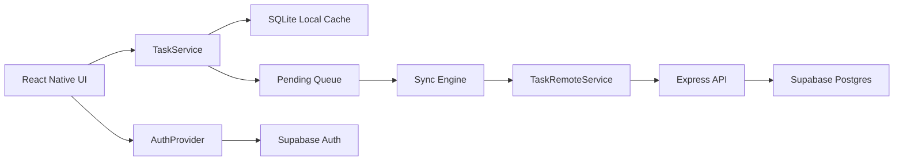

### What this means

* The UI does not talk directly to the database.
* The UI talks to a service layer.
* The service layer decides whether to read from SQLite, queue a local change, or sync with the backend.
* The backend owns the remote business logic and verifies identity using JWTs.
* Supabase stores authentication and remote persistent data.

This separation keeps responsibilities clear.

---

## Technology Choices

### Frontend

* **Expo SDK 56**
* **React Native**
* **Expo Router**
* **SQLite**
* **Supabase Auth**
* **Axios**
* **NetInfo**
* **Secure Store**
* **AsyncStorage**
* **Expo Crypto**

### Backend

* **Node.js 24.13.0**
* **Express**
* **Supabase Postgres**
* **JOSE**
* **Biome**
* **PNPM**

### Why these choices

I chose these tools because they are practical for a mobile-first assignment and they work well together:

* Expo Router gives file-based navigation and clean route grouping.
* Supabase Auth removes the need to write custom auth logic.
* Express gives control over backend business logic.
* SQLite gives real offline persistence on-device.
* NetInfo gives connectivity awareness.
* Axios gives a clean HTTP abstraction.
* Biome keeps linting and formatting simple and fast.

---

## What I Built

I built a system with:

* signup/login
* profile onboarding
* editable profile
* task creation
* task editing
* task deletion
* task restoration
* task completion toggling
* offline caching
* queued operations
* reconnect sync
* conflict reconciliation
* sync logging
* route protection
* a tab-based mobile UX
* a details stack screen

The app behaves as a real offline-first product rather than a simple CRUD demo.

---

## What I Did Not Build

I intentionally did **not** build:

* a third automation phase
* a custom auth backend
* a Redux/Zustand state architecture
* TypeScript migration
* CRDT-based conflict resolution
* hard delete as the default behavior
* direct frontend DB access for remote tasks
* a collaborative shared-edit model

### Why not?

Because each of those choices would have added complexity that was unnecessary for this assignment. The goal was depth, not breadth.

---

## Data Ownership Model

This is the most important concept in the project.

### Online mode

When the app is online:

* SQLite stores local state
* the backend stores canonical remote state
* the sync engine keeps them aligned

### Offline mode

When the app is offline:

* SQLite becomes the active working store
* user changes are captured locally
* operations are queued
* nothing is lost

### Sync mode

When the network returns:

* queued local mutations are replayed
* remote tasks are pulled down
* conflicts are resolved
* local state is reconciled

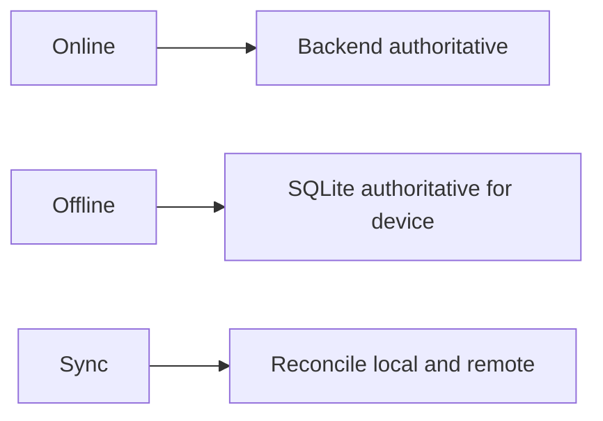

This model is the core of the app.

---

## Backend Architecture

The backend uses the classic Express architecture:

* route
* middleware
* controller
* service
* database

### Backend folder structure

```text
backend/src
├── config
├── controllers
├── middlewares
├── routes
├── services
├── utils
├── app.js
└── server.js
```

### Why this structure

I used this structure because:

* controllers stay thin
* services own business rules
* middleware owns cross-cutting concerns
* routes stay declarative
* errors can be handled centrally

This is a standard production-friendly Express pattern.

---

## Backend Request Flow

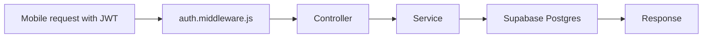

### How it works

1. The frontend sends a request with a Bearer token.
2. The backend verifies the JWT.
3. The middleware adds the authenticated user to `req.user`.
4. The controller reads `req.user.id`.
5. The service queries Supabase.
6. The response is sent back in a normalized shape.

---

## Why I Did Not Send `userId` From the Client

I intentionally do **not** send `userId` from the frontend when performing protected actions.

### Why?

Because that would be insecure.

If the client controls the user id, a malicious user could simply change the id and access another user’s tasks.

Instead:

* the JWT is verified on the backend
* the backend extracts the user identity
* all task queries are scoped to that identity

This is a fundamental security decision.

---

## Frontend Architecture

The frontend is structured around three ideas:

1. **screens render UI**
2. **services manage behavior**
3. **offline layer manages persistence and sync**

### Frontend folder structure

```text
frontend/src
├── api
├── components
├── context
├── hooks
├── lib
├── offline
├── services
└── utils
```

### Why this structure

This keeps the codebase easy to understand.

* `components` = reusable UI pieces
* `services` = application behavior
* `context` = app state and auth state
* `offline` = SQLite and sync internals
* `api` = HTTP client wrappers
* `lib` = external clients like Supabase

The frontend is organized around behavior, not just around file types.

---

## Navigation Architecture

I used a nested navigation structure:

* **Auth routes**
* **App routes**
* **Tabs**
* **Task details stack screen**

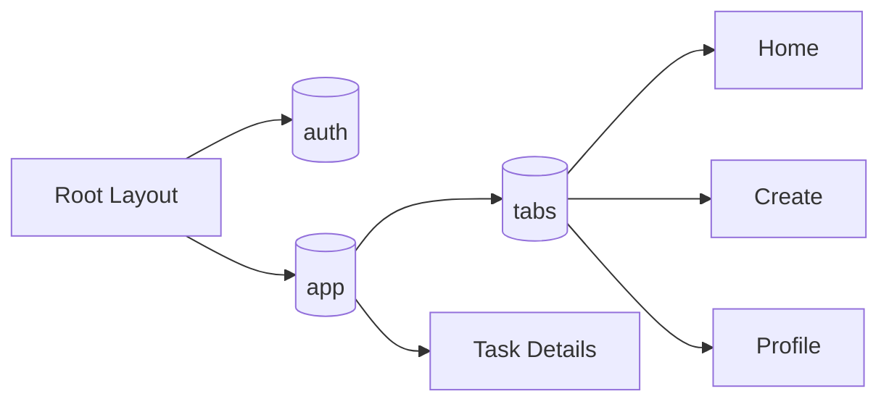

### Why tabs + stack

Tabs are best for the main destinations:

* Home
* Create
* Profile

Stack is best for secondary screens like task details.

This avoids clutter and keeps the app intuitive.

---

## Why I Did Not Put Task Details in Tabs

I intentionally kept task details outside the tab bar.

### Why?

Because task details are not a major destination. They are a contextual screen opened from Home.

If task details were in tabs, the bottom bar would become noisy and confusing.

---

## Authentication Architecture

The app uses **Supabase Auth** for identity.

The backend does not manage passwords directly.

### Auth flow

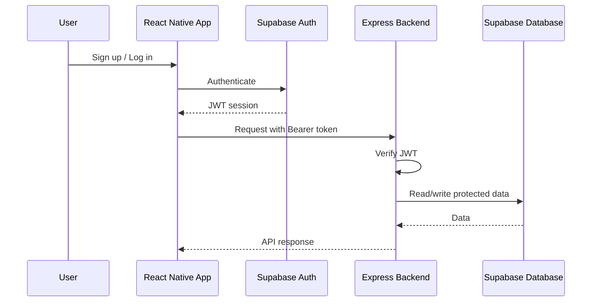

### Why this design

I chose this because it is simpler and safer than writing a full custom auth backend.

The backend only verifies JWTs and handles app-specific business logic.

---

## Why I Did Not Build Custom Login Routes in Express

I intentionally did not create `POST /login` or `POST /signup`.

### Why not?

Because Supabase Auth already solves:

* signup
* login
* session persistence
* refresh token handling
* secure auth storage

Writing a second auth system in Express would have duplicated effort and increased security responsibility.

---

## Profile Architecture

The profile is distinct from the auth identity.

### Why separate profile and auth?

Because auth identity and app-specific user information are not the same thing.

Supabase Auth stores identity-related information.
The `profiles` table stores application-facing profile data such as:

* username
* full name
* avatar path
* bio
* timezone
* locale
* onboarding completion
* theme preference

This gives the app a richer user model.

---

## Task Data Model

The task table is intentionally rich so the app can support a realistic workflow and future feature extensions.

### Main fields

* `id`
* `user_id`
* `title`
* `description`
* `status`
* `priority`
* `due_at`
* `reminder_at`
* `completed_at`
* `sort_order`
* `is_pinned`
* `is_recurring`
* `recurrence_rule`
* `metadata`
* `sync_version`
* `last_synced_at`
* `last_modified_by`
* `deleted_at`
* `archived_at`
* timestamps

### Why these fields exist

#### `status`

Supports todo / in-progress / done / archived.

#### `priority`

Supports simple task prioritization.

#### `due_at` and `reminder_at`

Supports schedule-oriented task planning.

#### `is_pinned`

Supports task elevation in the UI.

#### `is_recurring`

Supports recurrence semantics later.

#### `metadata`

Allows future extension without schema churn.

#### `sync_version`

Supports sync and conflict reasoning.

#### `deleted_at`

Supports soft delete and restore.

#### `archived_at`

Separates archival from deletion.

---

## Why I Used Soft Delete

I intentionally used soft delete instead of hard delete.

### Why?

Because offline sync and restore logic become much safer.

Soft delete means:

* tasks can be restored
* deletions can be replayed later
* sync history stays meaningful
* accidental data loss is reduced

This is the right choice for an offline-first task app.

---

## Backend Task Flow

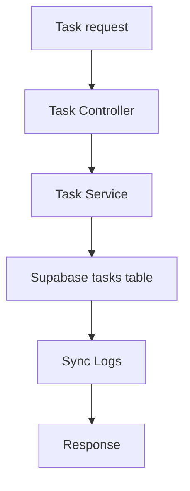

### What the backend does

The backend:

* validates access
* scopes queries to `req.user.id`
* reads and writes task data
* writes sync logs
* returns normalized API responses

---

## Offline Architecture

Offline support is the hardest part of the assignment, and it is the part I gave the most design attention to.

### Offline stack

* SQLite local cache
* pending operation queue
* sync metadata
* network monitor
* sync engine
* remote service wrapper

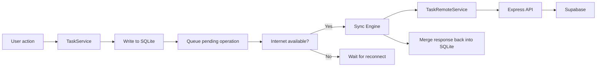

---

## Why I Used SQLite

I chose SQLite because the offline data is structured and relational.

### Why not AsyncStorage?

AsyncStorage is fine for small preferences or tokens, but it is not ideal for:

* many task records
* pending mutations
* sync metadata
* conflict state
* indexed task filtering

SQLite is the correct tool for this job.

---

## Why I Did Not Use Redux for Offline State

I did not use Redux or another global JS state store for persistence.

### Why?

Because persistence belongs in SQLite, not in a transient in-memory store.

The UI can use React state for rendering, but the real offline system needs disk persistence.

---

## Local Offline Tables

### `tasks_local`

This mirrors the backend task model locally.

### `pending_operations`

This stores queued changes that need to be synced.

### `sync_meta`

This stores sync timing and device metadata.

---

## Local Read Flow

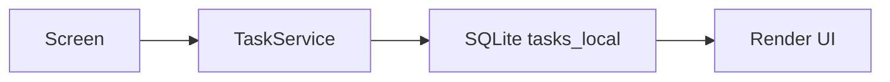

The UI reads local data first.

This is why the app still works when offline.

---

## Local Write Flow

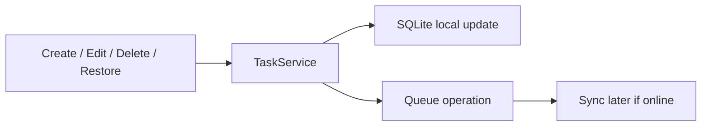

Every mutation is applied locally first.

That means the user gets immediate feedback even if the backend is unreachable.

---

## Sync Architecture

The sync engine is responsible for moving changes between the local device and the backend.

### Sync flow

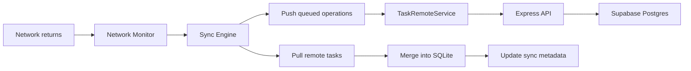

### Why the sync engine is separate

Because sync is not just “make a request”.

Sync includes:

* queue replay
* retry logic
* remote fetch
* local reconciliation
* conflict handling
* metadata updates

It deserves its own layer.

---

## Why I Used a Queue

I did not try to directly infer the final state from screen state alone.

Instead, I recorded each mutation as a queued operation.

### Why?

Because the queue provides:

* crash recovery
* mutation ordering
* retry capability
* traceability
* offline safety

This makes the offline system much more reliable.

---

## Remote vs Local Task Services

I intentionally separated two task service layers.

### `TaskService`

Used by screens.
It is local-first and offline-aware.

### `TaskRemoteService`

Used only by the sync engine.
It talks directly to the Express API.

### Why split them?

Because if the sync engine used the same service as the screens, it could recursively queue its own operations and create loops.

This separation prevents:

* duplicate sync writes
* recursive queue insertion
* confusion about source of truth

This was an important architectural decision.

---

## Conflict Strategy

I used a simple and explainable conflict strategy.

### Rule

1. Deletion wins over non-deletion.
2. Otherwise, the latest `updated_at` wins.

### Why this strategy

Because it is:

* easy to reason about
* predictable
* simple enough for a task app
* strong enough for interview discussion

I did not use CRDTs because that would be over-engineering for this domain.

---

## Conflict Examples

### Example 1: Two devices edit the same task

* Device A changes title
* Device B changes priority
* Both sync later

The latest update wins.

### Example 2: Delete vs update

* Device A deletes the task
* Device B edits the task

Deletion wins.

### Example 3: Offline edit followed by online edit

The conflict resolver uses timestamps and dirty flags to decide which side wins.

---

## Sync Logs

I added a sync log table to make the sync behavior auditable.

### Why?

Because offline-first apps need traceability.

The logs help with:

* debugging
* mutation history
* device tracing
* future analytics
* conflict diagnosis

The log table stores the operation, payload, previous state, new state, and device metadata.

---

## Device ID Strategy

I generate and store a persistent device id once and reuse it.

### Why?

Because sync logs should know which device generated a change.

That helps with:

* debugging
* sync traceability
* future analytics
* conflict tracking

The device id is not a secret. It is only metadata.

---

## Task Form Architecture

I refactored `TaskForm` into a pure controlled component.

### Why?

Because both create and edit screens use the same fields.

This means:

* one form definition
* one field layout
* less duplication
* easier future extension

The screen owns save logic.
The form owns rendering and field updates.

That separation is much cleaner.

---

## Task Screen Flow

### Home Screen

* reads tasks from SQLite
* renders instantly
* refreshes on focus

### Create Screen

* writes a local task
* queues a create operation
* syncs later if online

### Task Details Screen

* loads one task locally
* supports edit
* supports delete
* supports restore

### Profile Screen

* shows and edits profile fields
* saves profile through backend service

---

## Edge Cases Considered

### 1. App starts offline

* SQLite is used immediately
* UI still works
* no data is lost
* sync waits for connectivity

### 2. User creates a task offline

* task is saved locally
* operation is queued
* UI updates immediately
* remote sync waits

### 3. User edits the same task multiple times offline

* each mutation is captured
* the local state is updated
* sync later replays the latest state

### 4. User deletes then restores a task offline

* the local state reflects the latest action
* queued operations preserve intent
* sync later resolves to the most recent desired state

### 5. Two devices modify the same task

* timestamps and delete priority decide the winner
* local and remote state are reconciled later

### 6. Sync fails mid-flight

* local data remains intact
* queue entries remain available
* retries can happen later

---

## Why I Did Not Use Hard Delete

I intentionally avoided hard delete.

### Why?

Because hard delete breaks recoverability and complicates sync.

Soft delete is the safer and more realistic choice for this assignment.

---

## Why I Did Not Use a Generic State Library

I did not use Redux or Zustand.

### Why?

Because the system already has a stronger persistence boundary:

* SQLite for local state
* backend for remote state

A separate app-wide state library would have added complexity without improving the core architecture.

---

## Why I Consider the App Production-Minded

I consider the app production-minded because it handles:

* auth
* route protection
* profile onboarding
* local-first task storage
* queued sync
* remote reconciliation
* conflict strategy
* auditable logs

That combination is what makes the system feel real rather than purely demonstrative.

---

## Why I Did Not Build Everything in One Layer

I intentionally separated concerns into clear layers.

### Example

If the UI knew about SQLite details, sync queue internals, and backend API details, the code would become harder to maintain.

Instead, I kept the boundaries clean:

* screens render UI
* services coordinate behavior
* repositories talk to SQLite
* sync engine coordinates sync
* backend owns business rules
* Supabase owns auth and remote persistence

That is the architecture I would want to defend in an interview.

---

## Summary of Decisions

### I made these choices intentionally

* Supabase Auth for identity
* Express for backend business logic
* SQLite for offline persistence
* tabs + stack navigation
* soft delete instead of hard delete
* queue-based offline replay
* separate local and remote task services
* sync logs
* conflict handling by timestamps and delete priority

### I did not make these choices

* no custom auth backend
* no Redux
* no TypeScript
* no CRDTs
* no direct task DB access from screens
* no hard deletes
* no third phase automation implementation

---

## End-to-End Data Flow

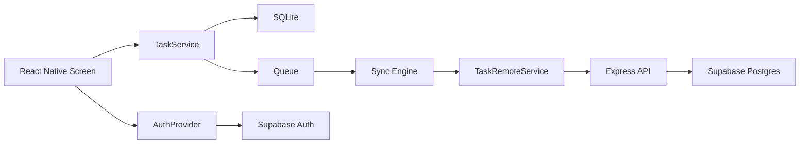

This is the core of the whole system.

The UI never needs to know whether a task came from SQLite or the backend.
It only knows that the task exists and is ready to render.

---

## Conclusion

This assignment was built to show that I can design and implement a real mobile architecture.

The important thing is not only that the app works.
It is that every major decision was made intentionally and can be explained clearly.

I focused on:

* clean boundaries
* secure auth
* local-first behavior
* reliable offline support
* conflict-aware sync
* maintainable routing
* a system that is practical to grow

That is the architecture behind the app.

